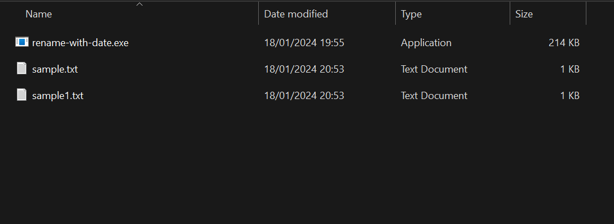
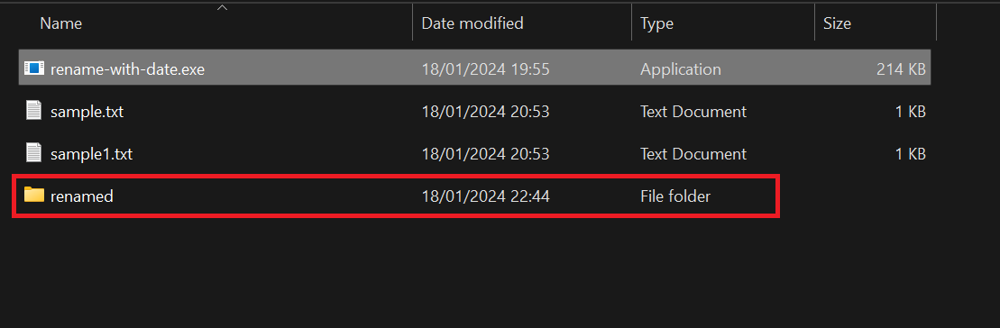
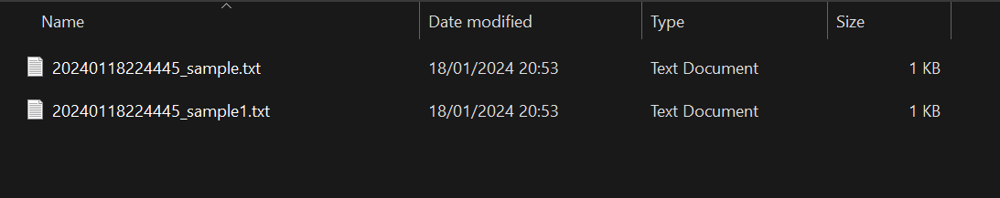

# Overview

The date and time are added to the beginning of the file name.

# Usage

## 1. Place rename-with-date.exe in the same directory as the target file.

## 2. Run rename-with-date.exe.

## 3. Check inside the renamed directory.

# LICENSE

MIT

# Author

Daiki Nakashima